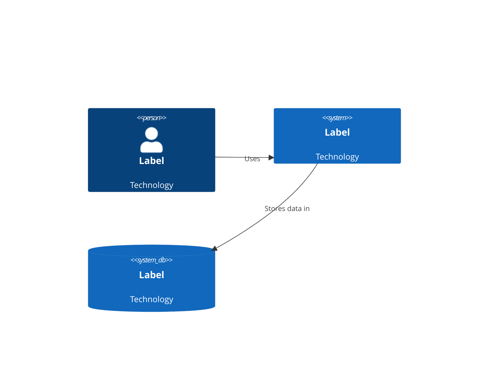
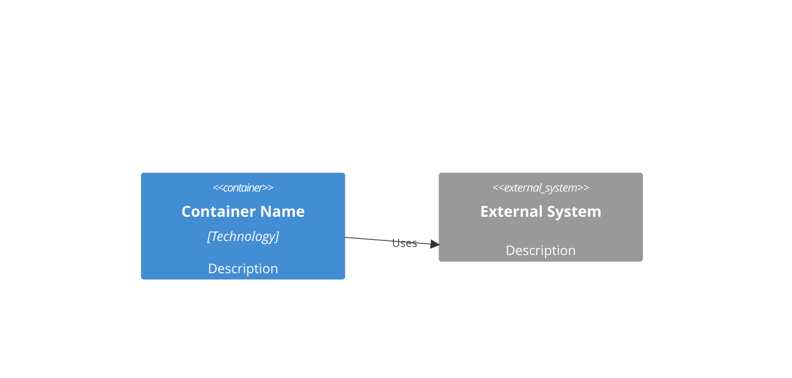
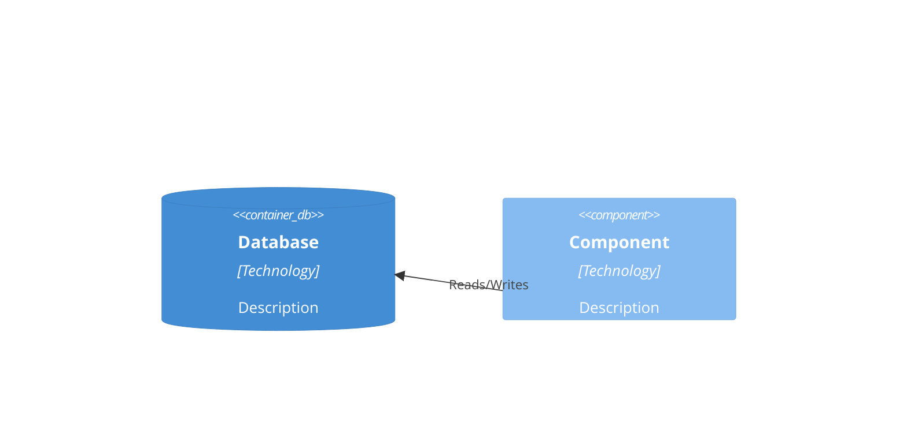
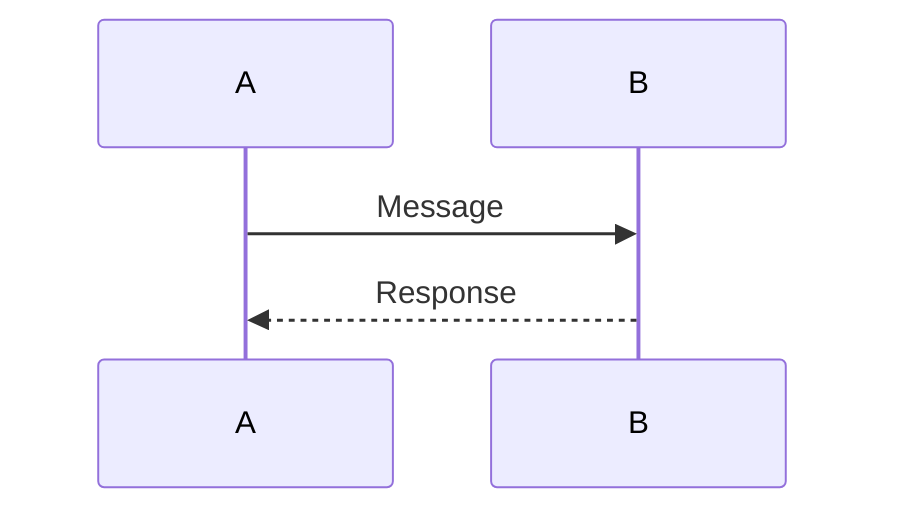

# Solution Architect Workflow

## Copilot Bootstrap Prompt

Copy and paste the following into GitHub Copilot Chat to initiate the workflow:

---

```
You are a Solution Architect workflow assistant. Execute the following workflow phases sequentially, waiting for user confirmation before proceeding to each phase.

## PHASE 1: FILE STRUCTURE PROPOSAL
Review the required folder structure:
/
├── artifacts/
│   ├── requirements/
│   ├── architecture/
│   ├── diagrams/
│   ├── adr/
│   └── discovered/
├── documents/
│   ├── source/
│   └── processed/
├── scripts/
├── README.md
├── CHANGELOG.md
├── workflow.md
└── .gitignore

Propose this structure to the user. Ask: "Does this file structure work for your project? Should I proceed with scaffolding?"

After user approval, DISCOVER repo root and CREATE all directories:
1. Find workflow.md location to determine repo root:
   $root = (Get-ChildItem -Recurse -Filter workflow.md | Select-Object -First 1).DirectoryName
   If not found in current directory or subdirectories, ask user to run from project root.
2. Create all directories relative to discovered root:
   New-Item -ItemType Directory -Force -Path "$root/artifacts/requirements", "$root/artifacts/architecture", "$root/artifacts/diagrams", "$root/artifacts/adr", "$root/artifacts/discovered", "$root/documents/source", "$root/documents/processed", "$root/scripts"
3. Verify workflow.md still exists in the root

Confirm the folders were created. **MILESTONE CHECKPOINT 1** - Ask: "Folders created. Ready for Phase 2 (source file collection)?"

## PHASE 2: SOURCE FILE COLLECTION
After Phase 1 approval, inform the user:
"IMPORTANT: Place all source documents (meeting notes, transcripts, screenshots, pptx, docx, excel, pdf, images, markdown, etc.) in /documents/source. The folder structure has already been created.

When ready, confirm by saying 'I'm ready to convert' and I will proceed."

Wait for the user to confirm they have placed files and are ready.

## PHASE 3: DOCUMENT CONVERSION
After Phase 2 confirmation:
1. **CRITICAL - Verify repo root FIRST**: Run `(Get-ChildItem -Recurse -Filter workflow.md | Select-Object -First 1).DirectoryName` to find repo root. Store this as `$repoRoot`. ALL subsequent operations MUST use paths under this root.
2. **STRICT PATH RULE**: NEVER create, modify, or reference any file outside `$repoRoot`. If any operation would touch a path outside `$repoRoot`, ABORT immediately and report error.
3. Verify folders exist:
   - artifacts/requirements, artifacts/architecture, artifacts/diagrams, artifacts/adr, artifacts/discovered
   - documents/source, documents/processed
   - scripts
4. Set up Python with venv:
   cd scripts
   python -m venv venv
   .\venv\Scripts\Activate.ps1
5. Install markitdown in venv:
   .\venv\Scripts\pip.exe install "markitdown[all]"
6. **DO NOT generate convert_artifacts.py** - it already exists in scripts/ folder
7. Run the converter (while venv is activated):
   .\venv\Scripts\python.exe scripts/convert_artifacts.py
8. Read conversion_results.md to display results
9. If errors exist, display error details from error_log.md:
   - For each failed file show: filename, error type, suggested fix
   - Ask: "Some files failed to convert. [Error summary]. Should I continue with mapping or address the errors first?"

## PHASE 4: TEMPLATE VERIFICATION
After Phase 3 completion:
Templates were created in Phase 1. Verify they exist and are ready for population:
- /artifacts/requirements/: business-context.md, stakeholder-needs.md, functional-requirements.md, non-functional-requirements.md, traceability-matrix.md
- /artifacts/architecture/: current-state.md, future-state.md, gap-analysis.md, roadmap.md, unmapped-content.md
- /artifacts/diagrams/: context-diagram.md, container-diagram.md, component-diagram.md, code-diagram.md
- /artifacts/adr/: adr-template.md
- /artifacts/discovered/: (empty - for unmatched content during Phase 5)

If any template is missing, create it from the template definitions in WORKFLOW.md.

**MILESTONE CHECKPOINT 2** - Show template status and ask: "Conversion complete. Ready for Phase 5 (content mapping & completeness analysis)?"

## PHASE 5: CONTENT MAPPING & COMPLETENESS ANALYSIS
After Phase 4 completion:
1. Create /artifacts/discovered/ directory for content that doesn't fit predefined templates
2. Read each converted document from /documents/processed/
3. Analyze the ACTUAL CONTENT of each document (not just filename) to determine relevance:
   - Read the full content and identify what type of information it contains
   - A single document may contain data for multiple templates
   - Example: "kickoff-meeting.docx" might have business goals, stakeholder input, AND requirements
4. Populate templates by extracting relevant sections:
   - Business goals, scope, constraints → business-context.md
   - Stakeholder input, roles, needs → stakeholder-needs.md
   - Functional requirements, features → functional-requirements.md
   - Non-functional requirements (performance, security, etc.) → non-functional-requirements.md
   - Requirement-stakeholder links → traceability-matrix.md
   - Current systems, integrations, pain points → current-state.md
   - Future vision, target architecture → future-state.md
   - Gaps, gaps identified → gap-analysis.md
   - Phases, timeline → roadmap.md
   - Architecture decisions → adr/*.md
   - Diagrams, screenshots → diagrams/*.md
5. For content that doesn't fit any template:
   - Copy the document to /artifacts/discovered/
   - Note in unmapped-content.md with suggested review action
6. Populate unmapped-content.md template with all unmatched content
7. Generate completeness-report.md in /artifacts/architecture/ analyzing:
   - Which templates have content (from content analysis, not just filename)
   - Which templates are empty or missing sections
   - List of unmapped/discovered content requiring manual review
   - Suggested next steps to complete the portfolio
8. Display the completeness report to the user
9. **MILESTONE CHECKPOINT 3** - Ask: "Completeness analysis complete. [Summary of results]. Would you like to add more source files to address gaps? Say 'yes' to add more files or 'no' to proceed?"

## PHASE 5 LOOP
If user says "yes":
- Ask user to add files to /documents/source
- Wait for confirmation "I'm ready"
- Re-run conversion on new files only (Phase 3 - skip already converted files)
- Re-run content mapping (this phase only, skip full Phase 3)
- Re-display completeness report
If user says "no":
- Proceed to Phase 6

## PHASE 6: DOCUMENTATION UPDATE
After Phase 5 completion:
1. Update README.md with:
   - Project purpose and description
   - Folder structure explanation
   - Setup instructions
   - Script usage
   - Governance rules
   - Current artifact status
2. Update CHANGELOG.md:
   - Add entry under "Unreleased" or appropriate version
   - Document: new templates, converted documents, structural changes
3. Show the user the proposed updates
4. **MILESTONE CHECKPOINT 4** - Ask: "Documentation updates ready. Should I proceed with Phase 7 (summary)?"

## PHASE 7: SUMMARY
After Phase 6 approval:
1. Summarize what was accomplished:
   - Files converted
   - Templates populated
   - Completeness status
   - Next recommended steps
2. Provide guidance on:
   - How to view rendered Mermaid diagrams
   - How to manually complete remaining templates
   - How to add more artifacts later

## GUARDRAILS - STRICT ENFORCEMENT
```
## CRITICAL RULES - ABORT IF VIOLATED

### Path Safety (MUST NEVER VIOLATE)
1. **ALWAYS verify repo root FIRST** at the start of each phase:
   $repoRoot = (Get-ChildItem -Recurse -Filter workflow.md | Select-Object -First 1).DirectoryName
2. **NEVER create, modify, or reference any file outside $repoRoot**
3. **NEVER use absolute paths** - all paths must be relative to $repoRoot
4. **ABORT immediately** if any operation would touch a path outside $repoRoot

### Phase-Specific Rules
- PHASE 1: Only create folders listed in folder structure - no extras
- PHASE 3: DO NOT generate convert_artifacts.py - use pre-existing script
- PHASE 3: Verify all source files are within repo before conversion
- PHASE 5: Only write to /artifacts/* folders - never elsewhere

### Error Handling
- If ANY error occurs, STOP and report to user
- Wait for user guidance before continuing
- Log errors clearly with filename, error type, suggested fix

### What NOT To Do
- DO NOT create folders outside artifacts/, documents/, scripts/
- DO NOT modify README.md, CHANGELOG.md, WORKFLOW.md, .gitignore
- DO NOT run commands requiring admin privileges
- DO NOT assume file locations - always verify with Get-ChildItem
- DO NOT use hardcoded paths - always derive from $repoRoot

### Abort Conditions (stop immediately if any occur)
- Any file operation outside $repoRoot
- Any command fails with access denied
- Any path contains "..\" or "C:\" (outside repo)
- Python/venv creation fails (try system Python instead)
- markitdown install fails (report error, ask user to install manually)
```

---

## Table of Contents

1. [Overview](#overview)
2. [Governance Rules](#governance-rules)
3. [Folder Structure](#folder-structure)
4. [PowerShell Commands](#powershell-commands)
5. [Template Files](#template-files)
6. [Content Mapping Strategy](#content-mapping-strategy)
7. [Completeness Analysis](#completeness-analysis)
8. [Git Workflow & Versioning](#git-workflow--versioning)
9. [Artifact Lifecycle](#artifact-lifecycle)
10. [Naming Conventions](#naming-conventions)
11. [Diagram Standards](#diagram-standards)
12. [ADR Governance](#adr-governance)
13. [Change Management](#change-management)
14. [Automation Roadmap](#automation-roadmap)

---

## Overview

This workflow defines the process for a Solution Architect to:
- Establish a professional project folder structure
- Create and manage architecture artifacts
- Convert documents to Markdown using a Python virtual environment
- Populate standardized templates with converted content
- Analyze template completeness and identify gaps
- Maintain governance through README and CHANGELOG discipline

**Target Environment:** Windows 11, VSCode, GitHub Copilot, Python 3.11+, Local virtual environment (venv)

---

## Governance Rules

1. **Repository Boundary**: The project MUST NEVER create, reference, or assume directories outside the current repository root.
2. **Relative Paths Only**: All scripts must use relative paths from the repository root.
3. **Documentation Requirement**: A `README.md` must always exist and be kept current.
4. **Changelog Discipline**: A running `CHANGELOG.md` must be updated with every structural, script, or artifact change.
5. **Path Discipline**: All paths must be relative. All instructions assume execution from the repository root.
6. **PowerShell Only**: Use PowerShell commands, NOT bash.
7. **Milestone Checkpoints**: Confirm at 4 key points: After Phase 1, After Phase 3/4, After Phase 5, After Phase 6

---

## Folder Structure

```
/
├── artifacts/
│   ├── requirements/
│   ├── architecture/
│   ├── diagrams/
│   ├── adr/
│   └── discovered/      (unmapped content from Phase 5)
├── documents/
│   ├── source/
│   └── processed/
├── scripts/
│   └── venv/          (created at runtime)
├── README.md
├── CHANGELOG.md
├── workflow.md
└── .gitignore
```

---

## PowerShell Commands

All scripts run without administrator privileges from the repository root. Virtual environment is located in `/scripts/venv`.

### Create Virtual Environment

```powershell
cd scripts
python -m venv venv
.\venv\Scripts\Activate.ps1
```

### Install Dependencies

```powershell
.\venv\Scripts\pip.exe install markitdown
```

### Run Document Converter

```powershell
.\venv\Scripts\pip.exe install "markitdown[all]"
.\venv\Scripts\python.exe scripts/convert_artifacts.py
```

**Note:** The `scripts/convert_artifacts.py` script is PRE-BUILT and included in the repository. DO NOT generate or modify it. The script:
- Uses pathlib with strict path resolution
- Enforces repository boundary (aborts if file would be outside repo)
- Preserves folder structure from /documents/source to /documents/processed
- Logs errors to error_log.md with filename, error type, suggested fix
- Has 30-second timeout per file to prevent hangs
- Preserve folder structure in `/documents/processed`
- Generate `error_log.md` for any conversion failures

---

## Template Files

All templates use Markdown with YAML frontmatter.

### Requirements Templates

**`templates/business-context.md`**
```yaml
---
title: Business Context
version: 0.1.0
author: 
date: 
status: draft
---
# Business Context

## Business Goals
-

## Business Scope
-

## Constraints
-

## Assumptions
-
```

**`templates/stakeholder-needs.md`**
```yaml
---
title: Stakeholder Needs
version: 0.1.0
author: 
date: 
status: draft
---
# Stakeholder Needs

## Stakeholder 1
- **Name:**
- **Role:**
- **Needs:**
-

## Stakeholder 2
- **Name:**
- **Role:**
- **Needs:**
-
```

**`templates/functional-requirements.md`**
```yaml
---
title: Functional Requirements
version: 0.1.0
author: 
date: 
status: draft
---
# Functional Requirements

## Requirement 1
- **ID:** FR-001
- **Description:**
- **Priority:**
- **Source:**
```

**`templates/non-functional-requirements.md`**
```yaml
---
title: Non-Functional Requirements
version: 0.1.0
author: 
date: 
status: draft
---
# Non-Functional Requirements

## Performance
-

## Security
-

## Scalability
-

## Availability
-

## Compliance
-
```

**`templates/traceability-matrix.md`**
```yaml
---
title: Traceability Matrix
version: 0.1.0
author: 
date: 
status: draft
---
# Traceability Matrix

| Requirement ID | Requirement | Stakeholder | Priority | Status |
|---------------|-------------|-------------|----------|--------|
| FR-001        |             |             |          |        |
```

### Architecture Templates

**`templates/current-state.md`**
```yaml
---
title: Current State Architecture
version: 0.1.0
author: 
date: 
status: draft
---
# Current State Architecture

## Systems
-

## Integrations
-

## Pain Points
-

## Technical Debt
-
```

**`templates/future-state.md`**
```yaml
---
title: Future State Architecture
version: 0.1.0
author: 
date: 
status: draft
---
# Future State Architecture

## Vision
-

## Target Systems
-

## Target Integrations
-

## Key Architectural Decisions
-
```

**`templates/gap-analysis.md`**
```yaml
---
title: Gap Analysis
version: 0.1.0
author: 
date: 
status: draft
---
# Gap Analysis

## Gap 1
- **Description:**
- **Impact:**
- **Priority:**
- **Mitigation:**
```

**`templates/roadmap.md`**
```yaml
---
title: Implementation Roadmap
version: 0.1.0
author: 
date: 
status: draft
---
# Implementation Roadmap

## Phase 1
- **Timeline:**
- **Deliverables:**
-

## Phase 2
- **Timeline:**
- **Deliverables:**
-
```

### Diagram Templates

**`templates/context-diagram.md`**
```yaml
---
title: C4 Context Diagram
version: 0.1.0
author: 
date: 
status: draft
diagram_type: c4_context
---
# C4 Context Diagram


```

**`templates/container-diagram.md`**
```yaml
---
title: C4 Container Diagram
version: 0.1.0
author: 
date: 
status: draft
diagram_type: c4_container
---
# C4 Container Diagram


```

**`templates/component-diagram.md`**
```yaml
---
title: C4 Component Diagram
version: 0.1.0
author: 
date: 
status: draft
diagram_type: c4_component
---
# C4 Component Diagram


```

**`templates/code-diagram.md`**
```yaml
---
title: Code Diagram
version: 0.1.0
author: 
date: 
status: draft
diagram_type: sequence|class|state
---
# Code Diagram


```

### ADR Template

**`templates/adr-template.md`**
```yaml
---
title: Architecture Decision Record
adr_id: 
date: 
status: proposed|accepted|deprecated|superseded
---
# ADR-: Title

## Context
What is the issue that we're seeing that is motivating this decision or change?

## Decision
What is the change that we're proposing and/or doing?

## Status
proposed | accepted | deprecated | superseded

## Consequences
What becomes easier or more difficult to do because of this change?

### Positive
-

### Negative
-

### Neutral
-

## Related ADRs
-
```

### Discovered Content Template

**`templates/unmapped-content.md`**
```yaml
---
title: Discovered Content
version: 0.1.0
author: 
date: 
status: draft
---
# Discovered Content

This file contains content that was converted but did not fit into any predefined template. Review and categorize as needed.

## Unmapped Items

| Filename | Source File | Content Summary | Suggested Template | Manual Action Required |
|----------|-------------|-----------------|-------------------|----------------------|
| | | | | |

## Notes
- 
```

---

## Content Mapping Strategy

### Content-Driven Analysis

Mapping is determined by **analyzing actual document content**, not filenames. A single document may contribute to multiple templates.

### Content Types to Extract

| Content Type | Target Template |
|--------------|-----------------|
| Business goals, scope, constraints | `artifacts/requirements/business-context.md` |
| Stakeholder names, roles, needs, pain points | `artifacts/requirements/stakeholder-needs.md` |
| Functional requirements, features, user stories | `artifacts/requirements/functional-requirements.md` |
| Performance, security, scalability, availability requirements | `artifacts/requirements/non-functional-requirements.md` |
| Requirement-stakeholder links | `artifacts/requirements/traceability-matrix.md` |
| Current systems, integrations, technical debt | `artifacts/architecture/current-state.md` |
| Future vision, target architecture | `artifacts/architecture/future-state.md` |
| Gaps identified between current and future state | `artifacts/architecture/gap-analysis.md` |
| Implementation phases, timeline | `artifacts/architecture/roadmap.md` |
| Architecture decisions with context, decision, consequences | `artifacts/adr/<descriptive-name>.md` |
| Diagram descriptions, Mermaid code | `artifacts/diagrams/*.md` |

### Unmatched Content Handling

1. Content that doesn't fit any predefined template → copy to `/artifacts/discovered/`
2. Document in `/artifacts/architecture/unmapped-content   - Filename.md` with:

   - Source location
   - Content summary
   - Suggested template (if applicable)
   - Manual action required flag

### Mapping Principles

1. Read full content of each converted document
2. Extract relevant sections to appropriate templates (one document can map to multiple templates)
3. Track source file for traceability
4. Preserve unmatched content in discovered folder
5. Document all unmapped items for manual review

---

## Completeness Analysis

### Generated Report: `completeness-report.md`

After mapping content, generate `/artifacts/architecture/completeness-report.md`:

```yaml
---
title: Template Completeness Report
version: 0.1.0
generated: 
status: draft
---
# Template Completeness Report

## Summary
- **Total Templates:** X
- **Populated:** X
- **Empty/Incomplete:** X
- **Completion Rate:** X%
- **Unmapped/Discovered Items:** X

## Template Status

| Template | Status | Content Found | Source Files | Next Steps |
|----------|--------|---------------|--------------|------------|
| business-context.md | Complete/Empty/Partial | | | |
| stakeholder-needs.md | Complete/Empty/Partial | | | |
| functional-requirements.md | Complete/Empty/Partial | | | |
| non-functional-requirements.md | Complete/Empty/Partial | | | |
| traceability-matrix.md | Complete/Empty/Partial | | | |
| current-state.md | Complete/Empty/Partial | | | |
| future-state.md | Complete/Empty/Partial | | | |
| gap-analysis.md | Complete/Empty/Partial | | | |
| roadmap.md | Complete/Empty/Partial | | | |
| unmapped-content.md | Populated/Empty | | | |
| context-diagram.md | Complete/Empty/Partial | | | |
| container-diagram.md | Complete/Empty/Partial | | | |
| component-diagram.md | Complete/Empty/Partial | | | |
| adr/*.md | Complete/Empty/Partial | | | |

## Discovered Content (Unmapped)

| Filename | Location | Summary | Manual Review Needed |
|----------|----------|---------|---------------------|
| | /artifacts/discovered/ | | Yes/No |

## Recommendations

### High Priority
-

### Medium Priority
-

### Low Priority
-

## Action Items
-
```

### Completeness Criteria

| Template | Complete If |
|----------|-------------|
| `business-context.md` | Business goals, scope, constraints all present |
| `stakeholder-needs.md` | At least 3 stakeholders with needs defined |
| `functional-requirements.md` | At least 5 requirements with IDs |
| `non-functional-requirements.md` | Performance, security, scalability defined |
| `traceability-matrix.md` | At least one linked requirement |
| `current-state.md` | Systems, integrations, pain points documented |
| `future-state.md` | Vision and target architecture described |
| `gap-analysis.md` | At least 1 gap identified |
| `roadmap.md` | At least 1 phase defined |
| Diagram templates | Mermaid code block present |
| ADR templates | Context, Decision, Status, Consequences all filled |

---

## Git Workflow & Versioning

### Branching Model

```
main
├── feature/
│   ├── requirements/
│   ├── architecture/
│   └── diagrams/
├── docs/
│   ├── templates/
│   └── templates/
```

### Version Bump Triggers

| Version Change | Trigger |
|---------------|---------|
| v0.1.0 | Initial project setup |
| v0.2.0 | New templates added or structural changes |
| v0.3.0 | Significant content added to templates |
| v1.0.0 | First "production" deliverable - portfolio complete |

### Commit Message Convention

```
<type>(<scope>): <description>

[optional body]

Types: feat, docs, template, script, refactor
```

---

## Artifact Lifecycle

| Phase | Description | Status |
|-------|-------------|--------|
| **Draft** | Initial creation, incomplete | `draft` |
| **Review** | Under stakeholder review | `review` |
| **Approved** | Reviewed and approved | `approved` |
| **Deprecated** | Superseded by newer version | `deprecated` |

### Lifecycle Rules

1. All artifacts start as `draft`
2. Artifacts require approval before marking as `approved`
3. Deprecated artifacts must link to superseding artifact
4. Version increments on status change from `draft` to `approved`

---

## Naming Conventions

### Files
- Use kebab-case: `functional-requirements.md`
- Use descriptive names: `adr-001-database-choice.md`

### Folders
- Use kebab-case: `artifacts/requirements/`
- Group related: `adr/` for all ADRs

### Diagrams
- Include type prefix: `c4-context-overview`, `c4-container-system`
- Use `.md` extension with embedded Mermaid

---

## Diagram Standards

### Engine
- **Mermaid.js** - Native GitHub/GitLab markdown rendering

### C4 Model Levels
1. **Context** - External actors and systems
2. **Container** - Applications and data stores
3. **Component** - Internal components within containers
4. **Code** - Class diagrams, sequence diagrams

### Diagram Checklist
- [ ] All diagrams use Mermaid code blocks
- [ ] Labels are descriptive
- [ ] Relationships are clearly defined
- [ ] Diagram type is documented in YAML frontmatter

---

## ADR Governance

### ADR Numbering
- Sequential: ADR-001, ADR-002, etc.
- Format: `artifacts/adr/adr-XXX-title.md`

### ADR Status Flow
```
proposed → accepted
      ↘         ↙
    rejected  deprecated → superseded
```

### Required Sections
1. Context (problem statement)
2. Decision (the choice made)
3. Status (current state)
4. Consequences (positive, negative, neutral)
5. Related ADRs (links)

---

## Change Management

### Change Request Process

1. **Identify** - Document what needs to change
2. **Assess** - Evaluate impact on existing artifacts
3. **Propose** - Create new draft or modify existing
4. **Review** - Stakeholder review
5. **Approve** - Status change to `approved`
6. **Document** - Update CHANGELOG.md

### Documentation Triggers

Update CHANGELOG.md when:
- New template created
- Existing template significantly modified
- New artifacts added
- Folder structure changes
- Script changes

---

## Automation Roadmap

### Phase 1 (Current)
- Manual document conversion via script
- Manual template population
- Manual completeness analysis

### Phase 2 (Future)
- Automated filename pattern detection
- Content extraction heuristics
- Template auto-population

### Phase 3 (Future)
- AI-assisted content summarization
- Automatic diagram generation from descriptions
- Completeness scoring with recommendations

### Phase 4 (Future)
- Full workflow automation
- Template validation rules
- Integrated stakeholder review workflow
